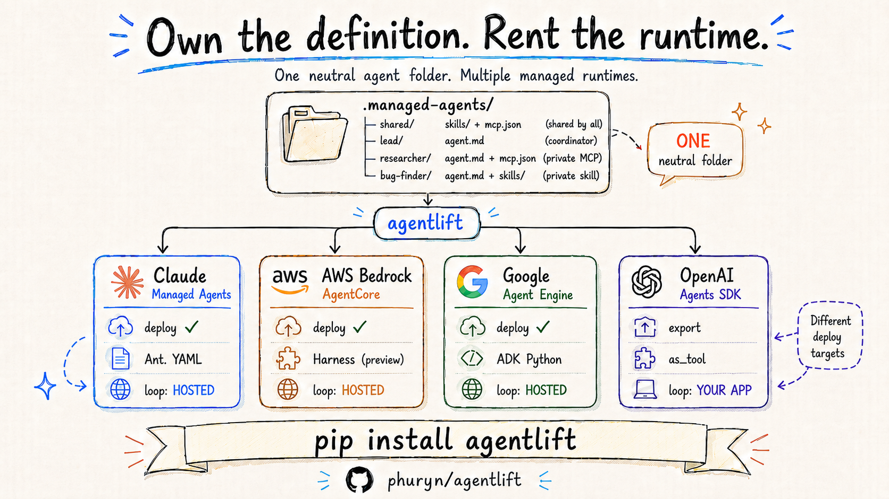

# agentlift



[](https://pypi.org/project/agentlift/)
[](LICENSE)


**Agent runtimes all want your agent in a different shape.** agentlift lets you define it
**once** as a neutral `.managed-agents/` folder — system prompt, skills, MCP servers, tool
allowlist, subagents — then **audit**, **export**, or **deploy** it to Anthropic Managed
Agents, AWS Bedrock AgentCore, Google Agent Engine, or OpenAI Agents SDK.

> **Own the definition. Rent the runtime.**

It's the folder you already use with Claude Code / the Agent SDK (`CLAUDE.md`/`agent.md` +
`skills/` + `.mcp.json` + a roster). Nothing new to learn — the thing you have *is* the input,
and it stays yours, not a vendor's.

```bash
pip install agentlift
agentlift audit  ./my-agent                  # how portable is it, per provider? (offline)
agentlift deploy ./my-agent                  # → Anthropic Managed Agents (reference target)
agentlift deploy ./my-agent --target bedrock # → AWS Bedrock AgentCore (Claude-native)
agentlift deploy ./my-agent --target google  # → Google Vertex AI Agent Engine (preview)
agentlift export openai-agents ./my-agent    # → an OpenAI Agents SDK script (self-host)
```

> `agentlift` not found after install? Run it module-style — `python -m agentlift.cli <cmd>`
> (the launcher just landed off `PATH`; [add it](docs/deploying.md) if you prefer the short form).

## Why this exists

Adopt a provider's native tooling — Anthropic YAML, a Bedrock Strands container, Google ADK
Python, an OpenAI graph — and your agents are now shaped by that provider. The day you want a
different runtime, you re-author everything. agentlift makes the **deploy unit the same folder
you develop against**, keeps it provider-neutral, and treats each runtime as a back-end of one
compiler. One definition, many backends, no lock-in.

## See it happen (a skill that runs *in the cloud*)

The believable bit isn't "we generated config" — it's that an uploaded skill actually fires
inside the hosted runtime. `plan` is a deterministic, no-network dry run; `deploy` pushes it;
`run` proves the skill rode along:

```console
$ agentlift plan ./examples/quickstart
Skills to upload: 1
  - receipt-stamp  (035823c8, 1 file)  used by: knowledge-agent
Agents to create: 1
  - knowledge-agent  [claude-haiku-4-5]  tools: read/glob/grep  skills: @skill:035823c8
Deployable: yes

$ agentlift deploy ./examples/quickstart -y
  skill 'receipt-stamp': uploaded skill_01Ph…   agent 'knowledge-agent': created agent_019L…
  Lockfile written: ./examples/quickstart/.agentlift-lock.json

$ agentlift run knowledge-agent --project ./examples/quickstart --task "What is a North Star metric?"
  A North Star metric is the single measure that best captures the value users get…
  RECEIPT: metric captured          ← the uploaded SKILL.md firing inside the hosted runtime
  latency 5.9s | in 4121 out 220 | ~$0.0044
```

The plan is a pure function of the folder (same input → same plan): it's the dry-run, the diff,
and what the offline tests assert against.

## The folder is the agent

agentlift reads a convention you may already use. A minimal single agent:

```
my-agent/.managed-agents/knowledge-agent/
├── agent.md          # YAML frontmatter + system prompt
├── skills/receipt-stamp/SKILL.md   # uploaded as a managed skill
└── knowledge/pm-basics.md          # folded into the system prompt
```

```markdown
---
name: knowledge-agent
model: claude-haiku-4-5
tools: [read, glob, grep]      # built-in allowlist (omit = all)
---
You are the Knowledge Agent. Answer product questions concisely.
```

…and the same convention scales to a **multi-agent system** — a coordinator, workers, shared
*and* private skills/MCP servers, all wired by frontmatter:

```
.managed-agents/
├── shared/skills/cite-sources/SKILL.md   # shared skill — uploaded once, used by many
├── shared/mcp.json                        # shared MCP — one server, many agents
├── lead/agent.md                          # subagents: [bug-finder, researcher] → coordinator
├── bug-finder/  (agent.md + skills/bug-report/)     # private skill
└── researcher/  (agent.md + mcp.json)               # private MCP
```

A bare ref (`search`) resolves to the agent's own resource first, then `shared/`. Your local
`.claude/agents/` are never swept in. Full spec: [docs/convention.md](docs/convention.md).

## How it works

`parse → plan → apply → run` — and only `apply`/`run` touch the network.

- **parse** — read the folder into an in-memory project (pure file IO).
- **plan** — a deterministic list of API ops with symbolic refs, skill dedup, validation, and
  diagnostics. No network. This is the dry-run *and* the test contract.
- **apply** — upload skills (deduped), create agents in order, write `.agentlift-lock.json`
  (local definition → remote IDs) so re-deploys are idempotent. [Commit it.](docs/deploying.md)
- **run** — invoke a deployed agent by ID, or run the same folder locally with `--local`.

Diagnostics surface anything a runtime can't represent — never a silent drop. Internals:
[docs/how-it-works.md](docs/how-it-works.md).

## Provider snapshot

One folder, four managed-agent runtimes — at **different maturity tiers**. `agentlift audit`
rates portability per provider *before* you deploy; the table below is what agentlift ships
**today**:

| Runtime | Deploy status | Model | Notes |
|---|---|---|---|
| **Anthropic** Managed Agents | ✅ Live — reference target, fullest mapping | Claude (native) | skills · MCP · `:ask` · coordinator |
| **AWS** Bedrock AgentCore | ✅ **Live** — **both primitives**: managed **Harness** (single agent · skills · MCP · sandbox · browser, **6/6 [live-verified](docs/tested-platforms.md#amazon-bedrock-agentcore-runtime--harness)**) and custom-container **Runtime** (multi-agent; **subagent delegation [live-verified](docs/tested-platforms.md#amazon-bedrock-agentcore-runtime--harness)**); the AWS AgentCore feature is in public preview | Claude (**native, no remap**) | `--mode auto` routes single→Harness, team→Runtime ([deploy-bedrock.md](docs/deploy-bedrock.md)) |
| **Google** Vertex AI Agent Engine | 🟡 Live (preview) | Claude → Gemini | skills · MCP · web tools; [deploy-google.md](docs/deploy-google.md) |
| **OpenAI** Agents SDK | 📦 Export / self-host | `gpt-*` | `as_tool` composition; no hosted-deploy path |

Each runtime captures the agent differently (Anthropic YAML, a Strands/AgentCore container, ADK
Python, an Agents SDK script) — the full cell-by-cell map is
[docs/provider-matrix.md](docs/provider-matrix.md). **Read the tier before assuming parity:**
Google is preview; on AWS a single agent deploys to the **Harness** and a multi-agent *team*
deploys to the custom-container **Runtime** (both live) — and the Runtime's *nested* specialist
skill/MCP calls are wired + output-corroborated, not independently exercised (the `/invocations`
response is the container's JSON body, not a tool-event stream).

## Proof, not assertion

agentlift's claims are pinned by tests and committed live receipts, not prose:

- **Live coverage matrix** — one neutral fixture deployed + queried on **Anthropic and Google**,
  with all six portability dimensions (agents · subagents · shared/individual MCP ·
  shared/individual skill) **EXERCISED server-side** (committed receipts under
  [`tests/live/receipts/`](tests/live/receipts/)).
- **AWS Bedrock AgentCore — both primitives live-verified** (committed Nova receipts):
  - **Harness, 6/6** (single agent): `CreateHarness → READY` then `InvokeHarness` exercising
    **agent + base-session sandbox + remote MCP + S3-loaded skill + `agentcore_browser`**.
  - **Runtime, multi-agent** (the headline): a real team (coordinator + 2 specialists) built to an
    ARM64 image → ECR → `CreateAgentRuntime → READY` → `InvokeAgentRuntime`, with **subagent
    DELEGATION exercised** (the coordinator's top-level trace named both specialists); a single-agent
    smoke separately exercised a root-level MCP call. Nested specialist skill/MCP are wired +
    text-corroborated (the `/invocations` body isn't a tool-event stream).
  - Model mapping stays **Claude-native**; the receipts run on **Nova** to prove the control plane,
    container, invocation path, and delegation while Claude-on-Bedrock access is account-gated (a
    one-time entitlement, not a code gap). Evidence: [docs/tested-platforms.md](docs/tested-platforms.md).
- **Managed vs local benchmark** ([benchmarks/results.md](benchmarks/results.md),
  `claude-haiku-4-5`):

  | Arm | Pass rate | Median latency | Avg cost |
  |---|---|---|---|
  | managed (cloud) | 100% on N=5 runs | 5.9s | $0.0052 |
  | local (your machine) | 100% on N=5 runs | 2.3s | $0.0034 |

  Pass = the uploaded skill fired **and** the answer was on-topic. Same folder, two runtimes,
  identical behavior.

```bash
pytest -m "not live"   # deterministic translation + idempotency — no API key, runs in CI
pytest -m live         # deploy to the real API, run, LLM-grade (needs credentials)
```

## What you get, briefly

- **Isolation by construction** — a deployed agent gets only its own folder (+ `shared/`); the
  repo-root `CLAUDE.md`, a sibling's skills, and your machine's MCP servers can't leak in. Pinned
  by [`tests/test_isolation.py`](tests/test_isolation.py).
- **Permissions that deploy** — append `:ask` to any tool (`bash:ask`, `create_issue:ask`) and
  the hosted agent pauses for caller approval — the deployable form of a hook.
- **Deploy how you work** — a command (`deploy --yes`), a [git-push workflow](examples/deploy-workflow/),
  or [from inside Claude Code](examples/claude-code-skill/). Idempotent via the lockfile.
- **A full CLI** — `validate` · `plan` · `audit` · `export` · `diff` · `deploy` · `run` ·
  `list` · `destroy` · `bench`. See [docs/deploying.md](docs/deploying.md).

## Documentation

| Doc | What's in it |
|---|---|
| [docs/convention.md](docs/convention.md) | The `.managed-agents/` folder spec — frontmatter, skills, MCP, `:ask`, subagents |
| [docs/how-it-works.md](docs/how-it-works.md) | `parse → plan → apply → run`, determinism, idempotency, the lockfile |
| [docs/deploying.md](docs/deploying.md) | The three deploy paths, commands, the lockfile, install/PATH |
| [docs/provider-matrix.md](docs/provider-matrix.md) | Cell-by-cell capability matrix across all four runtimes |
| [docs/anthropic-mapping.md](docs/anthropic-mapping.md) | Exact local → Managed Agents field mapping |
| [docs/deploy-bedrock.md](docs/deploy-bedrock.md) · [deploy-google.md](docs/deploy-google.md) | Per-provider credentials, gates, and caveats |
| [docs/tested-platforms.md](docs/tested-platforms.md) | Per-platform live receipts + reproduce steps |
| [docs/limitations.md](docs/limitations.md) | Honest constraints (stdio MCP, MCP auth, knowledge inlining) |

**Examples:** [`quickstart/`](examples/quickstart/) (one agent) ·
[`team/`](examples/team/) (coordinator + roster, shared skill, MCP, `bash:ask`) ·
[`in-a-project/`](examples/in-a-project/) (embedded in a real repo, proves isolation) ·
[`deploy-workflow/`](examples/deploy-workflow/) · [`claude-code-skill/`](examples/claude-code-skill/).

## Limitations

Each is surfaced as a `agentlift plan` diagnostic, never a silent surprise — full list in
[docs/limitations.md](docs/limitations.md):

- **Remote MCP only** — local `stdio` servers (`npx …`) can't be deployed; host behind HTTPS.
- **No inline MCP auth on Anthropic** (Bedrock + Google carry it via runtime env vars).
- **Knowledge files are inlined** into the system prompt (no persistent FS in the sandbox).
- **Maturity varies** — Anthropic is live/full; AWS is live on **both** AgentCore primitives (Harness single-agent + Runtime multi-agent; the AgentCore feature is in AWS preview); Google is live preview; OpenAI is export-only.
- **Runtime nested-tool visibility** — on the AWS Runtime, subagent delegation is objectively traced, but a *specialist's* internal skill/MCP calls don't cross the `/invocations` boundary (wired + output-corroborated, not independently exercised).

## Roadmap

Current focus: a **same-Claude-brain** AWS receipt (Gate A: the one-time Anthropic
use-case entitlement — the hosted Runtime + Harness are already live-proven on Nova), surfacing
the Runtime's nested specialist tool calls past the `/invocations` boundary, and a self-hostable
`openai-chatkit` export. Per-provider gaps and status live in their deploy docs and
[docs/provider-matrix.md](docs/provider-matrix.md).

## License

MIT — see [LICENSE](LICENSE).
