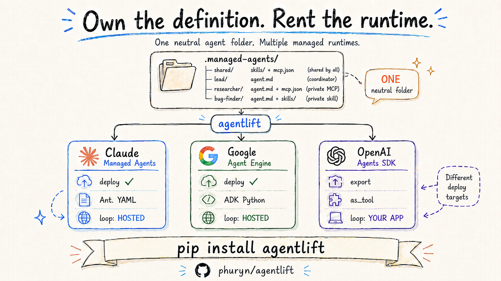

# agentlift



[](https://pypi.org/project/agentlift/)
[](LICENSE)


**Define your agent once as a folder. Audit how portable it is, compile it to any runtime's format, and deploy it live to a managed cloud — Anthropic Managed Agents, Google Vertex AI Agent Engine, or OpenAI Agents SDK. One neutral definition, many backends.**

Managed-agent runtimes are arriving fast: Anthropic Managed Agents, Google Vertex AI Agent Engine, OpenAI's Agent Builder. Each wants your agent in *its* shape — Anthropic's `ant` CLI takes Anthropic YAML, Google takes ADK Python, OpenAI a visual graph. Author against one and your definition becomes that vendor's shape; moving runtimes means re-authoring it.

agentlift keeps the definition neutral. Point it at the agent folder you already use with Claude Code / the Agent SDK (`CLAUDE.md`/`agent.md` + skills + `.mcp.json` + a subagent roster), and treat each runtime as a back-end of one compiler: `deploy` it to a managed cloud, `audit` how it maps across providers, or `export` it to a provider's own format (including the YAML the official `ant` CLI consumes — agentlift sits *above* `ant`, not against it).

```bash
pip install agentlift
agentlift audit  ./my-agent                       # how portable is it, per provider? (offline)
agentlift deploy ./my-agent                        # deploy to Anthropic Managed Agents (reference target)
agentlift deploy ./my-agent --target google        # deploy to Google Vertex Agent Engine (live, preview)
agentlift export openai-agents ./my-agent          # compile to an OpenAI Agents SDK script (self-host)
```

> The agent definition is the portable asset. The runtime is a deploy choice.
> **Own the definition. Rent the runtime.**

---

## Why this exists

A real agent is a system prompt, a few skills (each a directory of files), an MCP server or two, a tool allowlist, maybe a subagent roster. Every provider now has a way to deploy one — but each captures that definition in its own format (Anthropic YAML, Google ADK, an OpenAI graph). Adopt a provider's native tooling and your agents are now shaped by that provider; the day you want a different runtime, you re-author everything.

agentlift makes the deploy unit the same folder you develop against locally, and keeps it provider-neutral. Nothing new to learn; the thing you already have *is* the input — and it stays yours, not a vendor's.

## Install

```bash
pip install agentlift
export ANTHROPIC_API_KEY=sk-ant-...   # needs Managed Agents beta access
```

From source (for development):

```bash
git clone https://github.com/phuryn/agentlift && cd agentlift
pip install -e .
```

**`agentlift` "not found" / "not recognized" after install?** The package is fine; `pip` just put the launcher in a Scripts directory that isn't on your PATH. Two fixes:

- Run it module-style (always works, no PATH needed): `python -m agentlift.cli audit ./examples/team --targets anthropic,google,openai` — every `agentlift <cmd>` maps to `python -m agentlift.cli <cmd>`.
- Or add the launcher's folder to PATH. On **Windows** (where pip's per-user installs usually land off-PATH), add it to your user PATH and open a **new** terminal:

  ```powershell
  $d = python -c "import sysconfig; print(sysconfig.get_path('scripts','nt_user'))"
  [Environment]::SetEnvironmentVariable("Path", ([Environment]::GetEnvironmentVariable("Path","User").TrimEnd(';') + ";" + $d), "User")
  ```

  On **macOS / Linux** the dir is usually already on PATH; if not, find it with `python -c "import sysconfig; print(sysconfig.get_path('scripts'))"` and add it to your shell profile.

## The folder is the agent

> The walkthrough below uses **Anthropic Managed Agents**, the reference target — live deploy, the fullest feature mapping. For **Google** (live, preview) and **OpenAI** (export + self-host), jump to [Portability](#portability-audit--compile-across-runtimes).

agentlift reads a convention you may already use. Minimal single-agent project:

```
my-agent/
└── .managed-agents/              # the deploy folder — everything here is a deploy target
    └── knowledge-agent/
        ├── agent.md              # YAML frontmatter + system prompt
        ├── skills/
        │   └── receipt-stamp/
        │       └── SKILL.md      # uploaded as a managed skill
        └── knowledge/
            └── pm-basics.md      # folded into the system prompt
```

`agent.md`:

```markdown
---
name: knowledge-agent
model: claude-haiku-4-5
tools: [read, glob, grep]      # built-in tool allowlist (omit = all)
---
You are the Knowledge Agent. Answer product questions concisely.
Always sign off as "Best, Knowledge Agent".
```

Why a dedicated `.managed-agents/` folder instead of reusing `.claude/agents/`? Because that's where Claude's **local** agents and native subagents live — and those aren't deploy targets. A separate folder keeps "ship to the cloud" cleanly apart from "runs on my machine." Already have an embedded agent folder (`.claude/agents/<name>/` with `CLAUDE.md` + `.mcp.json` + `.claude/skills/...`)? Point agentlift straight at it to deploy just that one — `CLAUDE.md`, `.mcp.json`, and `.claude/skills/` are all read for back-compat. See [docs/convention.md](docs/convention.md).

## See exactly what will happen (no network)

```console
$ agentlift plan ./examples/quickstart

Skills to upload: 1
  - receipt-stamp  (035823c8, 1 file(s))  used by: knowledge-agent

Agents to create: 1
  - knowledge-agent  [claude-haiku-4-5]
      tools: builtins:read/glob/grep
      skills: @skill:035823c8

Diagnostics:
  info [knowledge-agent]: inlined 1 knowledge file(s) into the system prompt

Deployable: yes
```

The plan is a pure function of the folder — same input, same plan. It is the dry-run, the diff, and the thing the tests assert against.

## Deploy and run

```console
$ agentlift deploy ./examples/quickstart -y
Uploading skills...
  skill 'receipt-stamp': uploaded skill_01Ph... (used by knowledge-agent)
Creating agents...
  agent 'knowledge-agent': created agent_019L... v1
Lockfile written: ./examples/quickstart/.agentlift-lock.json

$ agentlift run knowledge-agent --project ./examples/quickstart \
    --task "What is a North Star metric? One sentence."

[managed] knowledge-agent
  ------------------------------------------------------------
  A North Star metric is the single measure that best captures the value
  users get from your product.

  RECEIPT: metric captured

  Best, Knowledge Agent
  ------------------------------------------------------------
  latency 5.9s | in 4121 out 220 | ~$0.0044 | tool_used=False
```

The `RECEIPT:` line is the uploaded `SKILL.md` firing **inside the hosted runtime** — proof the skill rode along, not just the prompt.

## Proven, not asserted

`benchmarks/run_benchmark.py` deploys the quickstart agent and runs it on both runtimes. Real numbers ([benchmarks/results.md](benchmarks/results.md), `claude-haiku-4-5`, N=5):

| Arm | N | Pass% | Median latency | Avg cost |
|---|---|---|---|---|
| managed (cloud) | 5 | 100% | 5.9s | $0.0052 |
| local (your machine) | 5 | 100% | 2.3s | $0.0034 |

Pass = the uploaded skill fired **and** the answer was on-topic. Same folder, two runtimes, identical behavior. (The live deploy → cloud-run → skill-applied path is also pinned by `tests/live/`.)

## What agentlift maps

| Local definition | → Managed Agents | Notes |
|---|---|---|
| `CLAUDE.md` / `agent.md` body | `system` prompt | frontmatter sets model, tools, etc. |
| `tools: [read, glob, ...]` | `agent_toolset_20260401` configs | mapped to `read/glob/grep/bash/edit/write/web_fetch/web_search`; unmappable tools dropped with a warning |
| `tools: [bash:ask]` / `allowedTools: [x:ask]` | tool `permission_policy` | `:ask` gates a tool behind caller approval; `:allow` (default) auto-approves — the deployable form of a hook |
| `skills/<name>/SKILL.md` (+ files) | uploaded skill → `{type:"custom", skill_id}` | content-addressed; identical skills upload **once** and are shared across agents |
| `.mcp.json` **remote** server | `mcp_servers:[{type:"url"}]` + `mcp_toolset` | per-server `allowedTools` becomes the **specific-tool** allowlist (and supports `:ask`) |
| `.mcp.json` **stdio** server (`npx ...`) | ✗ rejected | managed agents need a remote URL; clear error (or `--skip-unsupported`) |
| `knowledge/*.md` | folded into `system` | managed agents have no persistent local FS; see [limitations](docs/limitations.md) |
| `subagents: [a, b]` | `multiagent` coordinator | roster deployed first; depth-limit-1 enforced |

Full table and the exact wire format: [docs/anthropic-mapping.md](docs/anthropic-mapping.md).

## Portability: audit + compile across runtimes

The folder is provider-neutral, so agentlift treats each runtime as a back-end of one compiler. Same parsed model, three outputs:

| verb | what it does | network |
|---|---|---|
| `agentlift audit`  | report, per provider, what's `native` / `emulated` / `degraded` / `unsupported` | offline |
| `agentlift export` | compile the folder to a provider artifact (`anthropic-yaml` for `ant`, `google-adk`, `openai-agents`) | offline |
| `agentlift deploy` | push to a managed runtime via API (Anthropic + Google `--target google`, both live) | yes |

```console
$ agentlift audit ./examples/team --targets anthropic,google,openai
== Anthropic Managed Agents ==                   [8 native]
== Google Vertex AI Agent Engine (ADK) ==        [4 native, 2 emulated, 1 degraded, 1 unsupported]
  unsupported:
    x Per-tool approval gate (:ask / human-in-the-loop)
        reason: not enforced with VertexAiSessionService on the deployed runtime
  degraded:
    ! Built-in tool sandbox (bash / files / glob-grep / web)
== OpenAI (Agent Builder / Agents SDK) ==        [3 native, 1 emulated, 4 degraded]
  emulated:
    ~ Subagents -> coordinator (deployed roster)
        reason: agent-as-tool composition works (confirmed); the delegation loop runs in your orchestrator, not OpenAI-hosted
```

The audit's `degraded`/`unsupported` rows are exactly the lossy spots a compile would hit — so `audit` tells you what survives before `export` or `deploy` runs.

See the whole thing run offline (audit + both compiles, no API key) in [`demo/`](demo/): `./demo/portability-demo.sh` (Windows: `.\demo\portability-demo.ps1`).

A subagent roster is a **universal** capability, not a per-provider lottery: `native` on Anthropic (server-side coordinator), `emulated` elsewhere via agent-as-tool. Confirmed by actually running it on OpenAI (Agents SDK `as_tool`) and Google (ADK `sub_agents`) in [`experiments/subagent-composition`](experiments/subagent-composition/) — the only difference is whether the delegation loop runs in the provider's runtime or yours. Full per-platform test receipts, including a **live Google Agent Engine deploy** (a real `reasoningEngine`, server-side delegation confirmed) and the console/docs links for each provider: [`docs/tested-platforms.md`](docs/tested-platforms.md).

### Provider support

| Runtime | How agentlift targets it | Notes |
|---|---|---|
| **Anthropic Managed Agents** | `deploy` (live) + `export anthropic-yaml` | reference target; the folder maps 1:1. `export` emits the YAML the official `ant` CLI consumes — `ant` is one of agentlift's *outputs*, not a competitor. |
| **Google Vertex AI Agent Engine** | `deploy --target google` (live, preview) + `export google-adk` | I deployed the team folder to a live `reasoningEngine` (server-side delegation confirmed — see [tested-platforms](docs/tested-platforms.md)). `:ask` + the bash/web sandbox degrade; Claude models map to Gemini. |
| **OpenAI** | `export openai-agents` (preview, self-host) | subagents emulated via agent-as-tool (the delegation loop runs in your app); no code-define + OpenAI-host path, so `export`, never `deploy`. |

## Isolation: each agent gets only its folder

A deployed agent's context is exactly its own system prompt + its own (and `shared/`) skills + its own (and `shared/`) MCP servers + its inlined knowledge. The repo-root `CLAUDE.md`, a sibling agent's skills, and your machine's MCP servers **cannot leak in.**

This is the same isolation the local Agent SDK has to fight for — there the CLI walks up the directory tree and pulls in the repo-root `CLAUDE.md`, repo-root skills, and user-level MCP servers unless you set an explicit skills allowlist and `strictMcpConfig: true`. In the cloud there's no tree to walk: the agent only ever gets what agentlift uploads, and agentlift scopes uploads to the agent folder. You get isolation **by construction** — pinned by [`tests/test_isolation.py`](tests/test_isolation.py).

## Permissions and hooks

Claude Code hooks are local scripts, so they can't run in a cloud sandbox. Their main job — gating a tool behind approval — deploys as a per-tool **permission policy**. Append `:ask` to any built-in or specific MCP tool:

```yaml
tools: [read, glob, grep, bash:ask]                 # bash pauses for approval
```
```jsonc
{ "mcpServers": { "github": { "type": "url", "url": "https://…/mcp",
    "allowedTools": ["search_issues", "create_issue:ask"] } } }   // writes gated
```

At runtime an `:ask` call pauses the session (`requires_action`) for your app to approve or reject. Arbitrary hook *code* (custom block logic, PostToolUse capture) doesn't deploy — do path-guarding by not enabling the tool, and metadata capture from the session event stream. Details: [docs/deploying.md](docs/deploying.md#permissions-the-deployable-hook).

## Multi-agent, shared resources, subagents

```
.managed-agents/
├── shared/
│   ├── skills/cite-sources/SKILL.md     # shared skill — uploaded once, used by many
│   └── mcp.json                         # shared MCP — one server, many agents
├── lead/agent.md                        # subagents: [bug-finder, researcher]  → coordinator
├── bug-finder/
│   ├── agent.md                         # skills: [shared/cite-sources, bug-report]
│   └── skills/bug-report/SKILL.md       # agent-specific skill (only bug-finder)
└── researcher/
    ├── agent.md                         # mcp: [shared/docs, search]
    └── mcp.json                         # agent-specific MCP (only researcher)
```

One folder shows the whole capability model: a coordinator, two workers, a **shared**
skill and a **shared** MCP server, plus a **private** skill on one agent and a
**private** MCP server on another. The wiring is the frontmatter: shared resources
attach to any agent that references them; an agent-local `skills/` or `mcp.json` adds
private capability for that one agent. A bare name (`search`) resolves to the agent's
**own** resource first, then the shared one; `shared/<name>` always means the shared
copy. So `researcher` gets the shared `docs` server **and** its private `search`
server; `bug-finder` gets the shared `cite-sources` skill **and** its private
`bug-report`.

Subagents are unambiguous here: `lead`'s roster references other agents **in the
same `.managed-agents/` folder**, so they're deploy targets too. Your local
Claude subagents in `.claude/agents/` are never swept in.

```console
$ agentlift plan ./examples/team
Skills to upload: 2
  - cite-sources  (417213e5)  used by: bug-finder, researcher     # shared skill
  - bug-report    (d0f1cc36)  used by: bug-finder                 # agent-specific skill
Agents to create: 3
  - bug-finder  [claude-haiku-4-5]   tools: read/glob/grep/bash(ask)
  - researcher  [claude-haiku-4-5]   mcp: docs (shared) + search (private)
  - lead        [claude-haiku-4-5]   (coordinator -> @agent:bug-finder, @agent:researcher)
Deployable: yes
```

`bash(ask)` is a per-tool permission: `bug-finder` declares `tools: [..., bash:ask]`,
so the hosted agent pauses for caller approval before each `bash` call.

## How it works

`parse → plan → apply → run`.

- **parse** — read the folder into an in-memory project. Pure file IO.
- **plan** — produce a deterministic list of API operations with symbolic refs (`@skill:hash`, `@agent:name`), skill dedup, validation, and diagnostics. No network. This is what `agentlift plan` prints and what the offline tests assert.
- **apply** — execute the plan: upload skills (deduped), create agents in dependency order, write a `.agentlift-lock.json` mapping local definitions → remote IDs.
- **run** — invoke a deployed agent by ID (or run the same folder locally with `--local`).

The lockfile makes re-deploys idempotent: an unchanged skill is not re-uploaded, an unchanged agent is not re-created (verified in `tests/test_idempotency.py`, no network). Details: [docs/how-it-works.md](docs/how-it-works.md).

## Deploying — three ways, all things you already know

Deploy is declarative: the folder is the desired state, and `deploy` makes the cloud match it. Trigger it however you already work.

1. **A command** (solo): `agentlift plan .` then `agentlift deploy . --yes`.
2. **Git push** (teams, recommended): commit `.managed-agents/`, copy [`examples/deploy-workflow/ci-deploy.yml`](examples/deploy-workflow/ci-deploy.yml) into `.github/workflows/`, add an `ANTHROPIC_API_KEY` secret. Every push that touches the folder validates, deploys (idempotent), and commits the updated lockfile. Review in PRs; roll back with `git revert`.
3. **From Claude Code**: drop [`examples/claude-code-skill/deploy-managed-agents/`](examples/claude-code-skill/) into `.claude/skills/` and just say *"deploy my managed agents."*

Full guide + trade-offs: [docs/deploying.md](docs/deploying.md).

```
agentlift validate <path>              parse + plan, report problems (exit 1 on errors)
agentlift plan     <path> [--json]     show the deploy plan (dry run, no network)
agentlift audit    <path> --targets    portability report per provider (native/degraded/unsupported)
agentlift export   <target> <path>     compile the folder to a provider artifact (anthropic-yaml, google-adk, openai-agents)
agentlift diff     <path> [--remote]   what a deploy would change vs the lockfile
agentlift deploy   <path> [--prune]    upload skills + create agents; write lockfile
agentlift run <agent> --task "..."     invoke a deployed agent (--local for the same folder locally)
agentlift list     <path>              what's currently deployed (from the lockfile)
agentlift destroy  <path>              archive every agent in the lockfile
agentlift bench <agent> --task "..."   managed vs local: latency / cost / pass
```

`agentlift diff` shows new / changed / unchanged / stale before you deploy:

```console
$ agentlift diff .
Skills:
  + house-style  (new)
  = cite-sources  (unchanged)
Agents:
  ~ researcher  (changed)
  = fact-checker  (unchanged)
Stale (in lockfile, not in folder — archived with --prune):
  - old-agent

2 change(s) pending.  Run: agentlift deploy <path>
```

## Where the deployed IDs live

`deploy` writes **`.agentlift-lock.json`** next to the path you deployed — a map from each local definition to the remote object it became (`skill_…`, `agent_…`, version, spec hash). **Commit it.** It's what makes re-deploys idempotent (unchanged skills/agents are skipped), makes `agentlift run lead …` resolve by name, and lets a teammate or CI reuse the same cloud objects instead of duplicating them. It holds only IDs/hashes/titles — no secrets. It's per Anthropic account; commit it when your team shares one. More: [docs/deploying.md](docs/deploying.md#where-the-ids-live-the-lockfile).

## Tests

```bash
pytest -m "not live"     # deterministic translation + idempotency — no API key, runs in CI
pytest -m live           # deploy to the real API, run, LLM-grade the output (needs ANTHROPIC_API_KEY)
```

Offline tests pin the translation (tool mapping, per-tool permissions, skill dedup, stdio rejection, coordinator ordering, context isolation, diff, idempotency). Live tests deploy to Anthropic and confirm the uploaded skill actually fires in the cloud, graded by an LLM. CI runs the offline suite on every push and the live suite when an `ANTHROPIC_API_KEY` secret is present ([.github/workflows/ci.yml](.github/workflows/ci.yml)). A separate on-demand [live-demo workflow](.github/workflows/live-demo.yml) deploys the team example to a real account, runs the benchmark, and tears everything down — so the deploy path is demonstrably live, not just asserted.

## Limitations (read these)

- **Remote MCP only.** Managed agents connect to URL MCP servers; local `stdio` servers (`npx ...`) can't be deployed. Host them behind HTTPS first.
- **No inline MCP auth.** A managed URL MCP server carries no credentials in this API shape. The server must be public or authenticate itself.
- **Knowledge files are inlined** into the system prompt (no persistent local FS in the managed sandbox). Large reference sets should become a skill bundle.
- **Targets differ by handoff.** Anthropic Managed Agents has live deploy + the fullest mapping (the reference target). Google Vertex AI Agent Engine deploy is live in preview (`--target google`; MCP, skills, and `:ask` not mapped yet). OpenAI is export + self-host only (Agents SDK composition; no hosted-deploy path).

Each of these is surfaced as a `agentlift plan` diagnostic, not a silent surprise. More: [docs/limitations.md](docs/limitations.md).

## Documentation

Everything is here or one click away:

| Doc | What's in it |
|---|---|
| [docs/convention.md](docs/convention.md) | The `.managed-agents/` folder spec, frontmatter, skills, MCP, `:ask` permissions, native subagents |
| [docs/deploying.md](docs/deploying.md) | The three deploy paths, the lockfile / where IDs live, isolation, hooks |
| [docs/how-it-works.md](docs/how-it-works.md) | `parse → plan → apply → run`, determinism, idempotency, the confirmed wire format |
| [docs/anthropic-mapping.md](docs/anthropic-mapping.md) | Exact local → Managed Agents field mapping + API constraints |
| [docs/limitations.md](docs/limitations.md) | Honest constraints (stdio MCP, MCP auth, knowledge inlining, skill descriptions) |
| [docs/deploy-google.md](docs/deploy-google.md) | Deploying to Google Vertex AI Agent Engine — the ADC credentials + setup path |
| [docs/tested-platforms.md](docs/tested-platforms.md) | Per-platform test receipts (config, results, console links) for all three runtimes |
| [CONTRIBUTING.md](CONTRIBUTING.md) | Architecture and dev setup |

### Examples ([examples/](examples/))

- [`quickstart/`](examples/quickstart/) — one agent, one skill, knowledge, a tool allowlist
- [`team/`](examples/team/) — multi-agent: coordinator + roster, a shared skill, a remote MCP server, a `bash:ask` permission
- [`in-a-project/`](examples/in-a-project/) — `.managed-agents/` embedded in a real project; proves isolation (repo `CLAUDE.md`, app code, and a local `.claude/agents/` subagent are never deployed) + a coordinator with two shared-skill subagents
- [`deploy-workflow/`](examples/deploy-workflow/) — the git-push-to-deploy GitHub Action
- [`claude-code-skill/`](examples/claude-code-skill/) — deploy from inside Claude Code

## Roadmap

- **Google deploy parity** — the live `deploy --target google` is preview (Claude→Gemini model mapping; MCP, skills, and `:ask` not mapped yet). Bring it to full parity (MCP/skills, Claude-on-Vertex models, per-agent IDs via A2A).
- **`export openai-chatkit`** — wrap the `openai-agents` script in a self-hostable ChatKit server (the Agents SDK export already ships)
- Authenticated remote MCP via the Vaults API
- `agentlift diff --remote` deeper drift detection (full account reconciliation)
- A skill-bundle mode for large `knowledge/` sets

## License

MIT — see [LICENSE](LICENSE). Built on the [Anthropic Python SDK](https://github.com/anthropics/anthropic-sdk-python).
